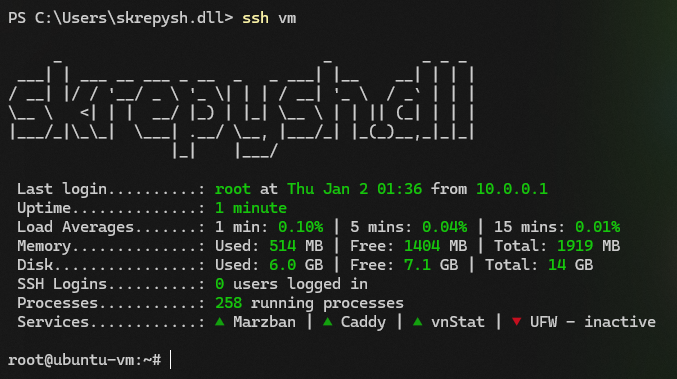

# motd



Custom MOTD scripts based off of [Skrepysh's motd](https://github.com/Skrepysh/motd), [Spookdev-MOTD](https://github.com/NeonWizard/spookdev-motd), and [PlexMOTD](https://github.com/40Cakes/PlexMOTD). This is running on Ubuntu or Debian, and the scripts are split into manageable chunks.

## Installation

1. Run the motd install script:

    ```bash
    curl -L https://raw.githubusercontent.com/Steeven9/motd/refs/heads/master/scripts/install.sh > motd_install.sh
    
    sudo chmod +x motd_install.sh && sudo ./motd_install.sh
    ```

1. Change `/etc/update-motd.d/colors.txt` to your liking.
1. Change services in `/etc/update-motd.d/09-services` to suit your needs.
1. Optionally change `PrintLastLog` to `no` in `/etc/ssh/sshd_config`.
